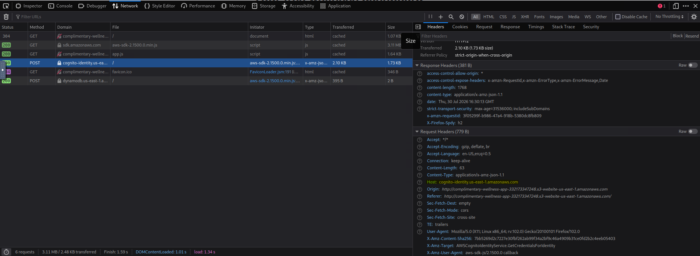
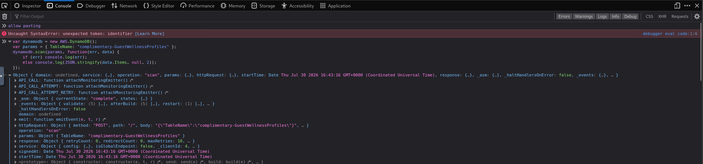
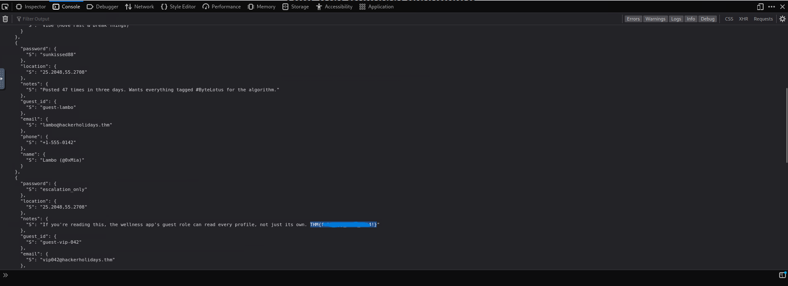

## Walkthrough: TryHackMe Room: "Complimentary" 

## Executive Summary
The **Complimentary** room simulates a critical cloud security misconfiguration involving **AWS Cognito Identity Pools** and **DynamoDB**. The vulnerability stems from the application issuing identical, overly permissive temporary AWS credentials to every user. This allows an attacker to bypass client-side restrictions and perform a `Scan` operation on the entire database, exposing all guest records including the hidden flag.

**Vulnerability Type:** Insecure Direct Object Reference (IDOR) / IAM Misconfiguration
**Impact:** Full data exfiltration of all user records (Contacts, Locations, Passwords)

---

## Phase 1: Reconnaissance & Credential Extraction
The application claims to be "frictionless," requiring no login. This is achieved by automatically authenticating every visitor via AWS Cognito. However, the implementation fails to isolate user sessions.

1.  **Open Developer Tools**: Press `F12` in your browser and navigate to the **Network** tab.
2.  **Identify the Request**: Refresh the page and filter for `cognito-identity`. Look for a `POST` request to `cognito-identity.[region].amazonaws.com`.
3.  **Extract Credentials**: Click the request and inspect the **Response** tab. You will see a JSON object containing:
    *   `AccessKeyId`
    *   `SecretKey`
    *   `SessionToken`
    *   `Expiration`


> *Figure 1: Extraction of temporary AWS security credentials from the network response.*

These keys are the root of the vulnerability. They are valid AWS credentials that the browser uses to talk directly to DynamoDB.

---

## Phase 2: Analysis of the Vulnerability
In a secure architecture, these credentials would have an IAM policy restricting access to a specific partition key (e.g., `guest_id == ${cognito-identity-id}`).

However, in this room:
*   The credentials are **identical for every user**.
*   The attached IAM policy allows `dynamodb:Scan` on the entire table `complimentary-GuestWellnessProfiles`.
*   The client-side JavaScript only requests a single item (`GetItem`), but the **keys themselves** permit reading everything.

---

## Phase 3: Exploitation via Browser Console
Instead of modifying network requests manually, we can leverage the AWS SDK already loaded in the browser to execute a `Scan` operation. This reads every item in the table, bypassing the intended "single user" view.

### Step 1: Prepare the Console
1.  Navigate to the **Console** tab in Developer Tools.
2.  If a security warning appears regarding pasting, type `allow pasting` and press **Enter**.

### Step 2: Execute the Scan Payload
Paste the following JavaScript code into the console. This initializes the DynamoDB client using the context of the current page (which already has the valid credentials injected) and requests a full table scan.

```javascript
var dynamodb = new AWS.DynamoDB();
var params = { TableName: "complimentary-GuestWellnessProfiles" };
dynamodb.scan(params, function(err, data) {
    if (err) console.log(err);
    else console.log(JSON.stringify(data.Items, null, 2));
});
```


> *Figure 2: Injecting the DynamoDB Scan command to retrieve all records.*

### Step 3: Analyze the Output
Press **Enter** to execute the code. The console will print a JSON array containing every item in the database.

*   Look for the `Items` array in the output.
*   Scroll through the entries. You will see multiple `guest_id` entries (e.g., `guest-Lambda`, `guest-xss-042`).
*   Locate the specific entry containing the flag format `THM{...}`.


> *Figure 3: Successful exfiltration of the database revealing the flag `THM{................}`.*

---

## Phase 4: Remediation & Lessons Learned
This exercise highlights three critical cloud security failures:

1.  **Lack of Fine-Grained Access Control (FGAC)**:
    *   **Fix**: The IAM policy associated with the Cognito Identity Pool should use policy variables to restrict access.
    *   *Example Condition*: `"Condition": { "ForAllValues:StringLike": { "dynamodb:LeadingKeys": ["${cognito-identity.amazonaws.com:sub}"] } }`

2.  **Over-Privileged Roles**:
    *   **Fix**: The role should only allow `dynamodb:GetItem`. The `dynamodb:Scan` and `dynamodb:Query` actions should be explicitly denied unless absolutely necessary, as they allow enumeration of the entire dataset.

3.  **Client-Side Trust**:
    *   **Lesson**: Never trust the client to enforce security boundaries. Even if the UI only shows one user, the underlying credentials must technically prevent access to others.


